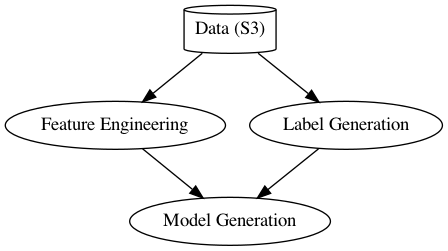

# DSC 102 - PA 1

Nick DeGroot\
A15948734

## Maximum Parallelization Graph


The feature engineering portion of this project and the label generation portion of this project do NOT depend on one another. For this reason, it's possible for both jobs to be run in parallel.

The same cannot be said about the model generation, who requires that both the previous jobs be done before its work can start.

## AWS Configuration
Initially, I used the console to figure out what features and settings were avaiable. Once I settled on a configuration that suited my needs, I wrote it into a bash script that I used to rapidly deploy new instances.

### EC2 / Dask
```bash
aws ec2 run-instances \
    --image-id ami-0cf6f5c8a62fa5da6 \
    --instance-type t3.xlarge \
    --key-name dsc102-pa1 \
    --instance-market-options '{ "MarketType": "spot" }' \
```

As recommended in class, I used spot instances in order to keep costs down. Even after running my code twice on EC2 instances, I managed to run everything with only ~$0.50 in costs!

Note that my WFH situation requires that I always check my data usage to make sure I'm not going over my data cap. In order to download/upload the files needed for this PA, I spun up a cheap t3.micro EC2 instance and did the network intensive operations on that. Thankfully, the AWS cloud centers have pretty good speeds!


### EMR / Spark
```bash
aws emr create-cluster \
    --applications Name=Spark Name=Zeppelin \
    --ebs-root-volume-size 10 \
    --ec2-attributes '{
        "KeyName": "dsc102-pa1",
        "InstanceProfile": "EMR_EC2_DefaultRole",
        "SubnetId": "subnet-cfa20385",
        "EmrManagedSlaveSecurityGroup": "sg-09218e53e9e1ab2ad",
        "EmrManagedMasterSecurityGroup": "sg-0582180ef22c38a8a"
    }' \
    --service-role EMR_DefaultRole \
    --enable-debugging \
    --log-uri 's3n://aws-logs-035170873046-us-west-2/elasticmapreduce/' \
    --name 'DSC102 PA1' \
    --instance-groups '[
        {
            "InstanceCount": 1,
            "EbsConfiguration": {
            "EbsBlockDeviceConfigs": [
                {
                "VolumeSpecification": { "SizeInGB": 32, "VolumeType": "gp2" },
                "VolumesPerInstance": 1
                }
            ]
            },
            "InstanceGroupType": "MASTER",
            "InstanceType": "m4.large",
            "Name": "Master Instance Group"
        },
        {
            "InstanceCount": 2,
            "EbsConfiguration": {
            "EbsBlockDeviceConfigs": [
                {
                "VolumeSpecification": { "SizeInGB": 32, "VolumeType": "gp2" },
                "VolumesPerInstance": 1
                }
            ]
            },
            "InstanceGroupType": "CORE",
            "InstanceType": "m4.large",
            "Name": "Core Instance Group"
        }
    ]' \
    --release-label emr-6.3.0 \
    --scale-down-behavior TERMINATE_AT_TASK_COMPLETION \
    --region us-west-2
```

My EMR configuration was exported directly from the EMR web UI. I stuck with mostly default settings on the latest EMR package, which boiled down to the following:

- Logging to a S3 bucket
- 2x Slave m4.large instances
- 1x Master m4.large instance
- emr-6.3.0 with Spark

## Working with Larger Data
If I were to do this assignment again with larger datasets, I'd start looking into more scalable ways to scale the model. For example, one easy win may come in the form of `dask-ml`'s XGBoost integration. Instead of downloading the files back to my computer and running single-threaded `pandas` operations, I could use Dask to split the training job between multiple cores (even scaling to multiple *machines* should the data become large enough).